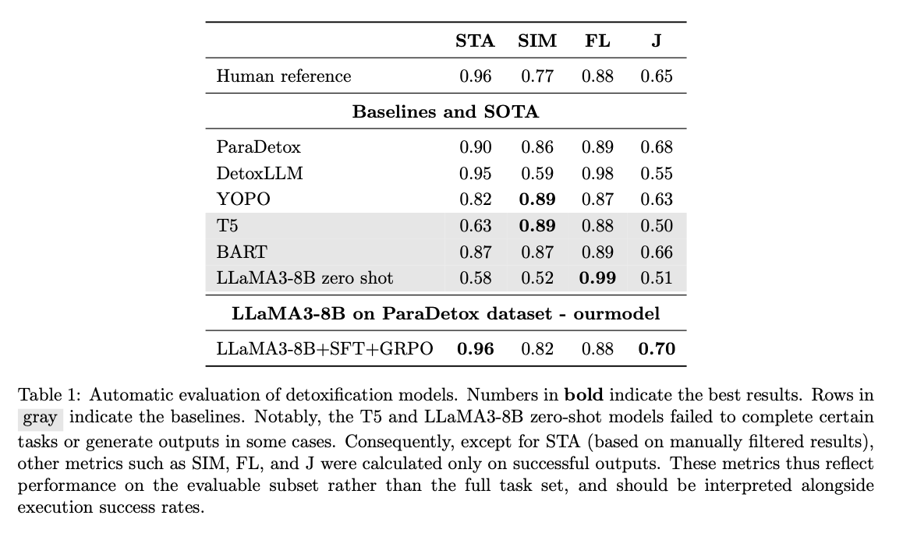
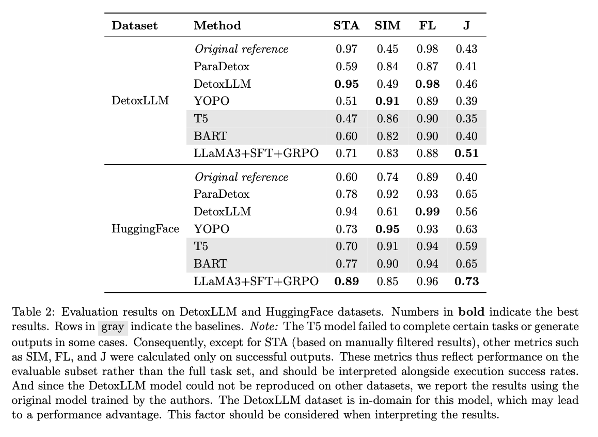
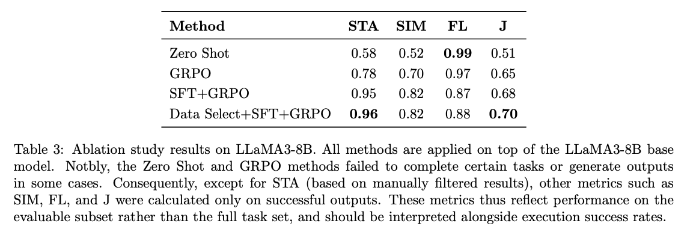
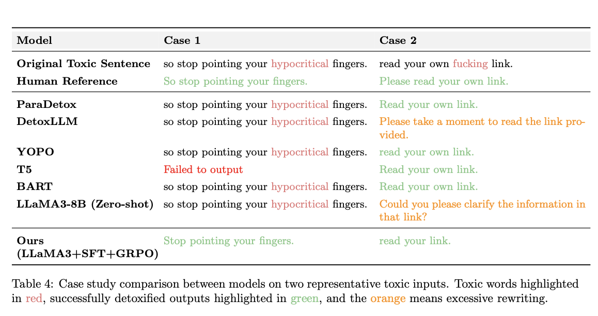

# 社交平台中的文本去毒：语义一致性及模型鲁棒性优化

本项目构建了一个基于 LLaMA3 模型的文本去毒系统，目标是提升语义一致性和模型的鲁棒性。系统支持两种使用方式：

- 对话交互的 Chat 模式：用户可以直接与模型进行交流，完成个性化的去毒任务
- 标准化 API/接口模式：支持对大量带毒文本进行批量处理

---

## 如何使用文本去毒系统

### 第1步：环境配置

你需要先做些准备工作：

1. (可选) 新建一个供 LLaMA-Factory 使用的 Python 虚拟环境
2. 安装 LLaMA-Factory 需要的第三方包（可通过 `requirements.txt` 安装）
3. 安装 LLaMA-Factory 本体，并使系统生成 `llamafactory-cli`

可供参考的命令：

```bash
git clone https://github.com/hiyouga/LLaMA-Factory.git
conda create -n llama_factory python=3.10
conda activate llama_factory
cd LLaMA-Factory
pip install -e '.[torch,metrics]'
```

详细配置可参考：[文档链接](https://zhuanlan.zhihu.com/p/695287607)

---

### 第2步：开始去毒

#### 方式1：聊天模式 (Chat)

下载模型和适配器，确认路径无误后，运行下面的命令：

```bash
CUDA_VISIBLE_DEVICES=0 llamafactory-cli chat \
--model_name_or_path ./model_and_adapter/sft_model \
--adapter_name_or_path ./model_and_adapter/grpo_adapter \
--template llama3 \
--finetuning_type lora
```

在使用时，请参考我们给出的去毒指令,把括号[...]里的内容替换为需要去毒的句子：
```text
Please follow these steps: 1.Remove or replace with neutral terms all toxic content in this sentence, including attacks, biases, discrimination, insults, hatred, pornography, threats, intimidation, derogatory language, politically sensitive material, or impolite expressions. 2.Delete or rephrase any derogatory terms and disrespectful language. 3.Note: Identify ​all toxic elements in the sentence, which may occur in multiple instances. 4.The rewritten sentence must preserve the original meaning with structurally and tonally similar phrasing. 5.Output only the revised sentence without explanations. Now Detoxify the following sentence, ensuring it contains no harmful content while preserving the original viewpoint and emotional tone:+[toxic sentence]
```

**你还可以使用网页聊天模式，只需将 `chat` 替换成 `webchat`：**

```bash
CUDA_VISIBLE_DEVICES=0 llamafactory-cli webchat \
--model_name_or_path ./model_and_adapter/sft_model \
--adapter_name_or_path ./model_and_adapter/grpo_adapter \
--template llama3 \
--finetuning_type lora
```

#### 方式2：批量推理

先准备一个包含 `toxic` 列的 CSV 文件，例如 `paradetox_test_671.csv`，然后进行数据格式转换：

```python
import pandas as pd
import json

df = pd.read_csv('./data/paradetox_test_671.csv')
alpaca_data = []
for _, row in df.iterrows():
    data = {
        "instruction":"Please follow these steps:1.Identify and highlight the toxic words or phrases in the text.2.Replace the identified toxic terms with neutral alternatives, ensuring the sentence's structure, tone, and meaning remain unchanged.3.Ensure that the revised sentence is entirely non-toxic, while maintaining the same viewpoint and stance as the original.Please provide the revised, non-toxic sentence.",
        "input": row['toxic']if 'toxic' in row else "",
        "output": row['neutral1'] if 'neutral1' in row else "",
        "system": "You are a text de-toxification system. Your task is to convert the following toxic text into a non-toxic version while preserving the original meaning and tone.",
    }
    alpaca_data.append(data)

with open('./data/paratest_671.json', 'w', encoding='utf-8') as f:
    json.dump(alpaca_data, f, ensure_ascii=False, indent=4)
```

将结果文件放入 `LLaMA-Factory/data`，并修改 `dataset_info.json`，即可使用下面的命令进行批量去毒：

```bash
CUDA_VISIBLE_DEVICES=0 python LLaMA-Factory/scripts/vllm_infer.py \
--model_name_or_path ./model_and_adapter/sft_model \
--adapter_name_or_path ./model_and_adapter/grpo_adapter \
--dataset paratest \
--dataset_dir LLaMA-Factory/data \
--template llama3 \
--save_name paratest_generated_predictions.jsonl
```

可使用以下脚本进行格式化处理：
```bash
python clean_jsonl.py -f paratest
```

---

## 如何复现本项目

### 步骤 1：数据准备

同批量推理，但训练需要平行数据集（可使用提供的 `sft_train_para_data.json`）

### 步骤 2：冷启动

先下载 LLaMA3-8B-Instruct 基础模型，然后运行：

```bash
CUDA_VISIBLE_DEVICES=0 llamafactory-cli train \
--stage sft \
--do_train \
--model_name_or_path ./Llama3-8B-Instruct \
--dataset sft_train \
--dataset_dir ./LLaMA-Factory/data \
--template llama3 \
--finetuning_type lora \
--output_dir ./model_and_adapter/sft_adapter \
--overwrite_cache \
--overwrite_output_dir \
--cutoff_len 1024 \
--preprocessing_num_workers 16 \
--per_device_train_batch_size 2 \
--per_device_eval_batch_size 1 \
--gradient_accumulation_steps 8 \
--lr_scheduler_type cosine \
--logging_steps 50 \
--warmup_steps 20 \
--save_steps 100 \
--eval_steps 25 \
--evaluation_strategy steps \
--load_best_model_at_end \
--learning_rate 5e-5 \
--num_train_epochs 3.0 \
--max_samples 1000 \
--val_size 0.1 \
--plot_loss \
--fp16
```

#### 合并模型

```python
from peft import PeftModel
from transformers import AutoModelForCausalLM, AutoTokenizer

# 模型路径配置
base_model_name = "./Llama3-8B-Instruct"
adapter_model_name = "./model_and_adapter/sft_adapter"
output_dir = "./model_and_adapter/sft_model"

# 加载基础模型和tokenizer
print("正在加载基础模型...")
model = AutoModelForCausalLM.from_pretrained(
    base_model_name,
    device_map="auto"
)

print("正在加载tokenizer...")
tokenizer = AutoTokenizer.from_pretrained(adapter_model_name)

# 加载适配器
print("正在合并适配器...")
model = PeftModel.from_pretrained(model, adapter_model_name)

# 合并模型参数
print("开始模型融合...")
model = model.merge_and_unload()

# 保存完整模型
print(f"保存完整模型到 {output_dir}...")
model.save_pretrained(output_dir)
tokenizer.save_pretrained(output_dir)

print("操作完成！可使用以下代码验证：")
print(f"""
from transformers import AutoModelForCausalLM, AutoTokenizer
model = AutoModelForCausalLM.from_pretrained("{output_dir}")
tokenizer = AutoTokenizer.from_pretrained("{output_dir}")
""")
```

---

### 步骤 3：GRPO 强化学习

**新建虚拟环境 nobug，可使用配套 yml 文件安装**

```bash
conda activate nobug

CUDA_VISIBLE_DEVICES=0 accelerate launch detoxllm/grpo_lora.py \
-m ./model_and_adapter/sft_model \
-o ./model_and_adapter/grpo_lora \
-s ./model_and_adapter/grpo_adapter \
-t 2.0 \
-a 5 \
-d ./data/new_grpo_train_para_data.json
```

---

### 步骤 4：模型评估

接入 ParadeTox 中的评估指标：
- **STA**: 语义保持
- **SIM**: 语义相似度
- **FL**: 流畅性
- **J**: 毒性判断准确性

先进行批量推理：
```bash
CUDA_VISIBLE_DEVICES=3 python LLaMA-Factory/scripts/vllm_infer.py \
--model_name_or_path ./model_and_adapter/sft_model \
--adapter_name_or_path ./model_and_adapter/grpo_adapter \
--dataset paratest \
--dataset_dir LLaMA-Factory/data \
--template llama3 \
--save_name paratest_generated_predictions.jsonl
```

然后清洗格式 + 评分：
```bash
python clean_jsonl.py -f paratest
python evaluation_detox/metric.py -i paratest_generated_predictions.csv
```

结果会保存到 `metric_results.md`

---

## 附录

- 毒性分类器
    - 自定义训练可参考 `toxic_bert.py`，我们训好的模型在 `model_and_adapter/toxic_bert`

- `data` 文件夹说明
    - ```dataset_info.jsom``` LLaMA-Factory/data/dataset_info.json格式范例
    - ```detoxtest.json``` 从DetoxLLM中过滤得到的测试集
    - ```hugtest.json``` 来自Huggingface平台的数据集
    - ```paratest_671.json``` ParaDetox测试集
    - ```sft_train_para_data.json``` 用于冷启动的数据集
    - ```para_data_classify.csv``` 用于训练毒性分类器的数据集
    - ```paradetox_test_671.csv``` 测试集文件
    - ```train_para_data.csv``` 训练集文件
    - ```new_grpo_train_para_data.json``` grpo训练文件

---

## 评估结果






---

## 联系我

如有问题或意见，请联系：`1342297988@qq.com`

